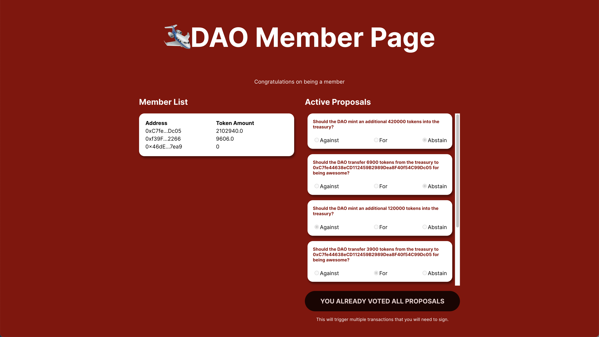

# buildspace x thirdweb - Build your own DAO with just Javascript - nomadDAO

This project uses thirdweb to handle the deployment of the following:

- Edition Drop Contract to allow multiple users to mint the required NFT to access the main page of nomadDAO
- ERC20 Token used as the nomadDAO Governance Token
- Airdrop governance token to NFT holders
- Voting contract to allow NFT holders to vote on proposals or create new ones
